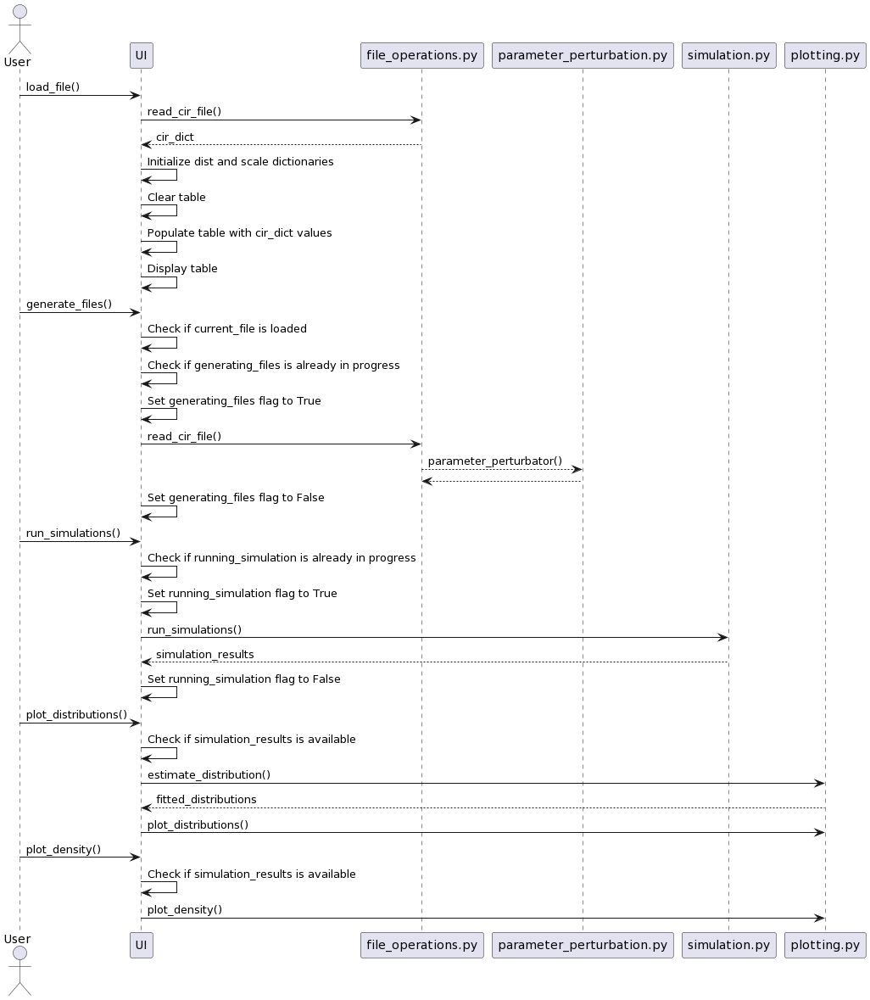

# Readme depreciado, nuevos TODO:

Hasta ahora el código produce los datos asociados a la simulación de los circuitos perturbados, es necesario hacer los módulos que correlacionan el valor de elementos de circuito con distintas funciones de recompensa que el usuario debe poder ingresar (es necesario ambas las implementaciones de UI y backend). Luego de esto hay que hacer el loop que optimiza el circuito recorriendo con los valores de elemento en la dirección correlacionada con la recompensa máxima. 

# Simulación de Circuitos con Perturbaciones - Documentación del Proyecto

El proyecto de simulación de circuitos con perturbaciones es una herramienta diseñada para realizar análisis de sensibilidad en circuitos electrónicos. El objetivo principal es evaluar el impacto de pequeñas variaciones en los valores de los componentes del circuito y estudiar cómo afectan el rendimiento y el comportamiento del sistema.

Para utilizar el software, el usuario debe proporcionar un archivo en formato .cir que contenga la descripción del circuito utilizando una netlist. Una netlist es una lista de nodos y elementos del circuito, como resistores, inductores, capacitores, fuentes de voltaje, etc. El archivo .cir también debe incluir los valores originales de los parámetros de los componentes.

Una vez que se carga el archivo .cir, el software realiza las simulaciones introduciendo pequeñas perturbaciones en los valores de los parámetros. Estas perturbaciones pueden seguir una distribución uniforme o probabilística alrededor del 3% del valor original de cada parámetro. La elección de la distribución depende de las preferencias del usuario y de la naturaleza del circuito.

El resultado de cada simulación se guarda en un archivo .cir separado, que contiene la descripción del circuito con los nuevos valores de los parámetros perturbados. Estos archivos pueden ser utilizados posteriormente para analizar el comportamiento del circuito en cada caso.

Además, el software puede generar informes o gráficos que resuman los resultados de todas las simulaciones realizadas. Estos informes pueden incluir estadísticas sobre el rendimiento del circuito, como la media y desviación estándar de las variables de interés, así como gráficos que ilustren las diferencias observadas en cada simulación.

El proyecto de simulación de circuitos con perturbaciones es una herramienta diseñada para realizar análisis de sensibilidad en circuitos electrónicos. El objetivo principal es evaluar el impacto de pequeñas variaciones en los valores de los componentes del circuito y estudiar cómo afectan el rendimiento y el comportamiento del sistema.

Para utilizar el software, el usuario debe proporcionar un archivo en formato .cir que contenga la descripción del circuito utilizando una netlist. Una netlist es una lista de nodos y elementos del circuito, como resistores, inductores, capacitores, fuentes de voltaje, etc. El archivo .cir también debe incluir los valores originales de los parámetros de los componentes.

Una vez que se carga el archivo .cir, el software realiza las simulaciones introduciendo pequeñas perturbaciones en los valores de los parámetros. Estas perturbaciones pueden seguir una distribución uniforme o probabilística alrededor del 3% del valor original de cada parámetro. La elección de la distribución depende de las preferencias del usuario y de la naturaleza del circuito.

El resultado de cada simulación se guarda en un archivo .cir separado, que contiene la descripción del circuito con los nuevos valores de los parámetros perturbados. Estos archivos pueden ser utilizados posteriormente para analizar el comportamiento del circuito en cada caso.

Además, el software puede generar informes o gráficos que resuman los resultados de todas las simulaciones realizadas. Estos informes pueden incluir estadísticas sobre el rendimiento del circuito, como la media y desviación estándar de las variables de interés, así como gráficos que ilustren las diferencias observadas en cada simulación.

## Descripción del Proyecto
El software permitirá a los usuarios simular circuitos con variaciones en los parámetros, generando muchos archivos .cir que pasan a ser guardados en memoria, esto permite tener muchos procesos independientes que pueden ser simulados por lotes, los cuales producen conjuntos de datos que a su vez (por lotes) son enviados a un servicio para almacenarlos y analizarlos. Los resultados del análisis son luego descargados de vuelta a la computadora del usuario.

### Requerimientos

1. El software debe aceptar archivos .cir para procesarlos.
2. El software debe permitir seleccionar el factor de escala de la distribución uniforme (centrada en el valor del parámetro de un circuito)
3. El software debe permitir seleccionar el factor de escala específica para cada elemento del circuito.
4. El software debe permitir seleccionar una distribución probabilística (centrada en el valor del parámetro de un circuito) específica para cada elemento del circuito.
5. El software debe generar una grán cantidad de archivos .cir (tamaño del lote), con valores para sus parámetros muestreados de las funciones probabilísticas.
6. El software debe simular esa grán cantidad de archivos .cir usando NGspice
7. El software debería tomar los resultados de ese lote de simulaciones y subirlos a un servicio para lograr analizarlos estadísticamente.
8. El software debe retornar la información relevante al usuario.
9. El software debe tener una interfaz gráfica.
## Dificultades y Facilidades

El proyecto presenta varias dificultades y facilidades que los desarrolladores deben tener en cuenta:

1. **Desarrollo de software**: Si bien los desarrolladores son estudiantes de ingeniería eléctrica, están cursando en un curso de desarrollo de software. Esto proporciona una base sólida en la implementación de software.

1. **Simulación de circuitos**: La simulación precisa de circuitos puede ser compleja debido a la interacción entre diferentes elementos y la propagación de señales. Será necesario usar librerías disponibles que realicen la simulación para nosotros.

2. **Perturbaciones y distribuciones probabilísticas**: Generar perturbaciones en los valores de los parámetros de los elementos del circuito y aplicar distribuciones probabilísticas requiere un conocimiento sólido de las técnicas estadísticas. Se deben implementar algoritmos que generen las perturbaciones y los cálculos de distribuciones adecuados.

3. **Integración con servicios en la nube**: El envío de los resultados de simulación a un servicio en la nube como Prometheus implica la comprensión de cómo interactuar con la API del servicio y garantizar la seguridad y confidencialidad de los datos enviados.

### Facilidades:

1. **Desarrollo de software**: Si bien los desarrolladores son estudiantes de ingeniería eléctrica, están cursando en un curso de desarrollo de software. Esto proporciona una base sólida en la implementación de software.

2. **Herramientas de simulación**: Existen herramientas de simulación de circuitos disponibles, como NgSpice a través de PySpice, que proporcionan una interfaz de programación para interactuar con el simulador. Esto facilitará la implementación de la funcionalidad de simulación en el software.

3. **Metodología ágil**: La adopción de una metodología ágil permitirá a los desarrolladores iterar rápidamente, adaptarse a los cambios y mantener una comunicación constante con los clientes o profesores que supervisen el proyecto.

## Diagrama


Como se logra ver en el diagrama el Usuario interactúa con la InterfazDeUsuario, la cual proporciona métodos para cargar el archivo .cir, ajustar los parámetros de perturbación y controlar la ejecución de las simulaciones. La InterfazDeUsuario se comunica con el ModuloGeneracionPerturbaciones y también con la opción de ModuloSimulacion, ya que no siempre es necesario agregar perturbaciones si algún caso lo requiriera.

Después de cada simulación, el ModuloSimulacion se conecta con la base de datos MySQL para almacenar los resultados. Finalmente, el ModuloAnalisisEstadistico realiza el análisis estadístico utilizando los datos almacenados en MySQL.

## Requisitos del Sistema

- Python 3.x
- Bibliotecas requeridas (se especificarán en el archivo `requirements.txt`)

## Arquitectura del Software

El software se basará en una arquitectura modular que permita la escalabilidad y el mantenimiento fácil. A continuación, se describen los componentes clave del software:

2. **Módulo de Generación de Perturbaciones**: Este módulo se encargará de generar perturbaciones en los valores de los elementos del circuito. Utilizará distribuciones uniformes y probabilísticas para generar las perturbaciones alrededor del 3% del valor original de los elementos. Genera una grán cantidad de netlists que pasan a ser simulados por lotes en el siguiente módulo.

3. **Módulo de Simulación**: Este módulo interactuará con herramientas de simulación de circuitos como NgSpice

4. **Integración con MySQL**: Después de cada simulación, los resultados se enviarán al servicio en la nube MySQL para su almacenamiento. Se utilizará la API de MySQL para enviar los datos y garantizar su integridad y seguridad.

5. **Módulo de Análisis Estadístico**: Una vez que todos los datos estén almacenados en MySQL, se realizará un análisis estadístico de los resultados para generar una serie temporal de distribuciones probabilísticas asociadas a las simulaciones realizadas. Esto permitirá a los usuarios comprender la variabilidad de los resultados y evaluar la robustez del circuito ante las perturbaciones.

## Instalación y Configuración

1. Clona este repositorio en tu máquina local.
1. Verificar más a fondo las funciones
2. Integrar con un servicio en la nube.
   ```
   pip install -r requirements.txt
   ```
4. Configura las opciones de conexión con el servicio MySQL, incluyendo la URL, las credenciales y otros parámetros relevantes. Esto se puede realizar en el archivo de configuración `MySQL_config.json`.

## Uso

1. Asegúrate de tener el archivo `.cir` con la descripción del circuito que deseas simular.
3. Inicia la ejecución de las simulaciones.
4. Una vez completadas las simulaciones, los resultados se enviarán automáticamente al servicio mySQL para su almacenamiento.
5. Utiliza las herramientas de análisis proporcionadas para explorar los resultados estadísticos y las distribuciones probabilísticas generadas.

<<<<<<< HEAD
## Requerimientos a instalar

- PySpice: "PySpice: a Python module to interface with Ngspice and Xyce, Pierre-Emmanuel Gaillardon, Xavier Jehl, Fabien Soulier, and Philippe Vivet, Journal of Open Source Software, 4(44), 1827, [doi 🔗](10.21105/joss.01827) ." [Sitio oficial 🔗](https://pyspice.fabrice-salvaire.fr/) [Instalación 🔗](https://pyspice.fabrice-salvaire.fr/releases/v1.3/installation.html#:~:text=PySpice%20is%20available%20on%20the%20Python%20Packages%20PyPI,to%20install%20the%20latest%20release%3A%20pip%20install%20PySpice) 
- Scipy:  "Virtanen, P., Gommers, R., Oliphant, T.E. et al. SciPy 1.0: fundamental algorithms for scientific computing in Python. Nat Meth 17, 261–272 (2020). [doi 🔗](https://doi.org/10.1038/s41592-019-0686-2)." [Sitio oficial 🔗](https://scipy.org/) [Instalación 🔗](https://scipy.org/install/)
- Ast: "Python Software Foundation. (2023). ast — Abstract Syntax Trees. Python 3.11.4 Documentation. Obtenido el 10 de Julio del 2023, [de 🔗](https://docs.python.org/3/library/ast.html)."
- OS: "Python Software Foundation. (2017). os — Miscellaneous operating system interfaces. Python 3.11.4 Documentation. Obtenido el 10 de Julio del 2023, [de 🔗](https://docs.python.org/3/library/os.html)."
- NetworkX : "Hagberg, A., Schult, D., & Swart, P. (2008). Exploring network structure, dynamics, and function using NetworkX. In Proceedings of the 7th Python in Science Conference (pp. 11-15)." [Sitio oficial 🔗](https://networkx.org/) [Instalación 🔗](https://networkx.org/documentation/networkx-1.1/install.html#:~:text=Get%20NetworkX%20from%20the%20Python%20Package%20Index%20at,that%20matches%20your%20operating%20system%20and%20Python%20version.)
- Matplotlib : "Hunter, J. D. (2007). Matplotlib: A 2D graphics environment. Computing in Science & Engineering, 9(3), 90-95." [Sitio oficial 🔗](https://matplotlib.org/) [Instalación 🔗](https://pypi.org/project/matplotlib/)
- Regex : "regex. (2023). PyPI. Obtenido el 10 de Julio del 2023, [de 🔗](https://pypi.org/project/regex/)."
- Numpy : "Harris, C. R., Millman, K. J., van der Walt, S. J., Gommers, R., Virtanen, P., Cournapeau, D., ... & Oliphant, T. E. (2020). Array programming with NumPy. Nature, 585(7825), 357-362." [Sitio oficial 🔗](https://numpy.org/) [Instalación 🔗](https://numpy.org/install/)
- Seaborn : "Waskom, M., Botvinnik, O., O'Kane, D., Hobson, P., Ostblom, J., Lukauskas, S., ... & Augspurger, T. (2021). mwaskom/seaborn: v0.11.2 (January 2021). Zenodo. Obtenido [de 🔗](https://doi.org/10.5281/zenodo.3892921)." [Sitio oficial 🔗](https://seaborn.pydata.org/) [Instalación 🔗](https://seaborn.pydata.org/installing.html)
1. Verificar más a fondo las funciones

## Licencia

## TODO.

<<<<<<< HEAD

## Requerimientos a instalar

- PySpice: "PySpice: a Python module to interface with Ngspice and Xyce, Pierre-Emmanuel Gaillardon, Xavier Jehl, Fabien Soulier, and Philippe Vivet, Journal of Open Source Software, 4(44), 1827, [doi 🔗](10.21105/joss.01827) ." [Sitio oficial 🔗](https://pyspice.fabrice-salvaire.fr/) [Instalación 🔗](https://pyspice.fabrice-salvaire.fr/releases/v1.3/installation.html#:~:text=PySpice%20is%20available%20on%20the%20Python%20Packages%20PyPI,to%20install%20the%20latest%20release%3A%20pip%20install%20PySpice) 
- Scipy:  "Virtanen, P., Gommers, R., Oliphant, T.E. et al. SciPy 1.0: fundamental algorithms for scientific computing in Python. Nat Meth 17, 261–272 (2020). [doi 🔗](https://doi.org/10.1038/s41592-019-0686-2)." [Sitio oficial 🔗](https://scipy.org/) [Instalación 🔗](https://scipy.org/install/)
- Ast: "Python Software Foundation. (2023). ast — Abstract Syntax Trees. Python 3.11.4 Documentation. Obtenido el 10 de Julio del 2023, [de 🔗](https://docs.python.org/3/library/ast.html)."
- OS: "Python Software Foundation. (2017). os — Miscellaneous operating system interfaces. Python 3.11.4 Documentation. Obtenido el 10 de Julio del 2023, [de 🔗](https://docs.python.org/3/library/os.html)."
- NetworkX : "Hagberg, A., Schult, D., & Swart, P. (2008). Exploring network structure, dynamics, and function using NetworkX. In Proceedings of the 7th Python in Science Conference (pp. 11-15)." [Sitio oficial 🔗](https://networkx.org/) [Instalación 🔗](https://networkx.org/documentation/networkx-1.1/install.html#:~:text=Get%20NetworkX%20from%20the%20Python%20Package%20Index%20at,that%20matches%20your%20operating%20system%20and%20Python%20version.)
- Matplotlib : "Hunter, J. D. (2007). Matplotlib: A 2D graphics environment. Computing in Science & Engineering, 9(3), 90-95." [Sitio oficial 🔗](https://matplotlib.org/) [Instalación 🔗](https://pypi.org/project/matplotlib/)
- Regex : "regex. (2023). PyPI. Obtenido el 10 de Julio del 2023, [de 🔗](https://pypi.org/project/regex/)."
- Numpy : "Harris, C. R., Millman, K. J., van der Walt, S. J., Gommers, R., Virtanen, P., Cournapeau, D., ... & Oliphant, T. E. (2020). Array programming with NumPy. Nature, 585(7825), 357-362." [Sitio oficial 🔗](https://numpy.org/) [Instalación 🔗](https://numpy.org/install/)
- Seaborn : "Waskom, M., Botvinnik, O., O'Kane, D., Hobson, P., Ostblom, J., Lukauskas, S., ... & Augspurger, T. (2021). mwaskom/seaborn: v0.11.2 (January 2021). Zenodo. Obtenido [de 🔗](https://doi.org/10.5281/zenodo.3892921)." [Sitio oficial 🔗](https://seaborn.pydata.org/) [Instalación 🔗](https://seaborn.pydata.org/installing.html)
1. Verificar más a fondo las funciones
2. Integrar con un servicio en la nube.
3. Identificar más requerimientos.
=======
1. Diagrama de estados
2. Sintetizar los contenidos del curso como requerimientos de la documentación y el software.
>>>>>>> 92ab4d87ab2d841c3a3b2229df433304d598450b
=======
>>>>>>> 4ef9149bf3bad9f951de5ea928b1a1616fa7c4e1

## Contacto

Si tienes alguna pregunta o sugerencia relacionada con este proyecto, no dudes en ponerte en contacto conmigo:

- Desarrollador: [Erick Marín Rojas](mailto:erick.marinrojas@ucr.ac.cr)

## Requerimientos a instalar

- PySpice: "PySpice: a Python module to interface with Ngspice and Xyce, Pierre-Emmanuel Gaillardon, Xavier Jehl, Fabien Soulier, and Philippe Vivet, Journal of Open Source Software, 4(44), 1827, [doi 🔗](10.21105/joss.01827) ." [Sitio oficial 🔗](https://pyspice.fabrice-salvaire.fr/) [Instalación 🔗](https://pyspice.fabrice-salvaire.fr/releases/v1.3/installation.html#:~:text=PySpice%20is%20available%20on%20the%20Python%20Packages%20PyPI,to%20install%20the%20latest%20release%3A%20pip%20install%20PySpice) 
- Scipy:  "Virtanen, P., Gommers, R., Oliphant, T.E. et al. SciPy 1.0: fundamental algorithms for scientific computing in Python. Nat Meth 17, 261–272 (2020). [doi 🔗](https://doi.org/10.1038/s41592-019-0686-2)." [Sitio oficial 🔗](https://scipy.org/) [Instalación 🔗](https://scipy.org/install/)
- Ast: "Python Software Foundation. (2023). ast — Abstract Syntax Trees. Python 3.11.4 Documentation. Obtenido el 10 de Julio del 2023, [de 🔗](https://docs.python.org/3/library/ast.html)."
- OS: "Python Software Foundation. (2017). os — Miscellaneous operating system interfaces. Python 3.11.4 Documentation. Obtenido el 10 de Julio del 2023, [de 🔗](https://docs.python.org/3/library/os.html)."
- NetworkX : "Hagberg, A., Schult, D., & Swart, P. (2008). Exploring network structure, dynamics, and function using NetworkX. In Proceedings of the 7th Python in Science Conference (pp. 11-15)." [Sitio oficial 🔗](https://networkx.org/) [Instalación 🔗](https://networkx.org/documentation/networkx-1.1/install.html#:~:text=Get%20NetworkX%20from%20the%20Python%20Package%20Index%20at,that%20matches%20your%20operating%20system%20and%20Python%20version.)
- Matplotlib : "Hunter, J. D. (2007). Matplotlib: A 2D graphics environment. Computing in Science & Engineering, 9(3), 90-95." [Sitio oficial 🔗](https://matplotlib.org/) [Instalación 🔗](https://pypi.org/project/matplotlib/)
- Regex : "regex. (2023). PyPI. Obtenido el 10 de Julio del 2023, [de 🔗](https://pypi.org/project/regex/)."
- Numpy : "Harris, C. R., Millman, K. J., van der Walt, S. J., Gommers, R., Virtanen, P., Cournapeau, D., ... & Oliphant, T. E. (2020). Array programming with NumPy. Nature, 585(7825), 357-362." [Sitio oficial 🔗](https://numpy.org/) [Instalación 🔗](https://numpy.org/install/)
- Seaborn : "Waskom, M., Botvinnik, O., O'Kane, D., Hobson, P., Ostblom, J., Lukauskas, S., ... & Augspurger, T. (2021). mwaskom/seaborn: v0.11.2 (January 2021). Zenodo. Obtenido [de 🔗](https://doi.org/10.5281/zenodo.3892921)." [Sitio oficial 🔗](https://seaborn.pydata.org/) [Instalación 🔗](https://seaborn.pydata.org/installing.html)
